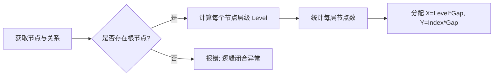
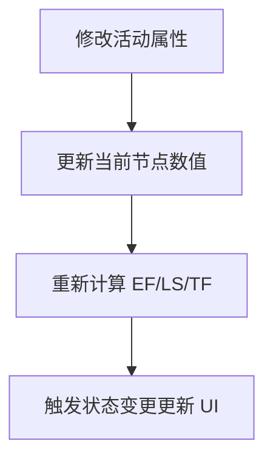
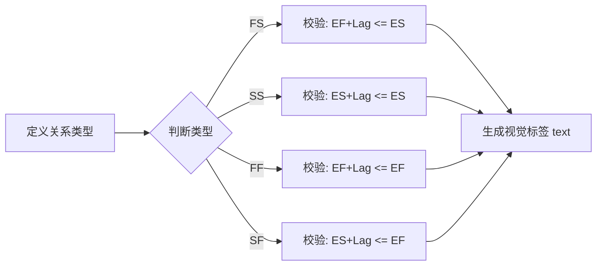
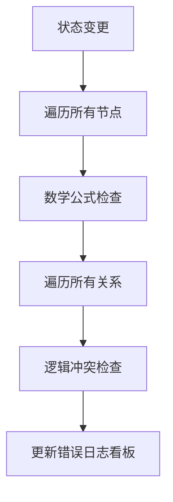
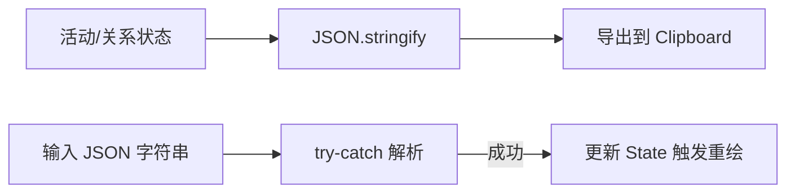

# PMP PDM Expert Engine Pro - 专家级进度网络分析引擎

这是一个专为 PMP（项目管理专业人士）设计的 **PDM（Precedence Diagramming Method，紧前关系绘图法）** 模拟与分析引擎。它能够自动处理复杂的项目逻辑，计算关键路径，并实时诊断逻辑冲突。

## PDM 与七格图

### PDM（紧前关系绘图法）
是项目管理中创建进度网络图的标准方法。它通过节点表示活动，用箭头表示活动之间的逻辑关系。

### 七格图
是 PDM 的核心载体，用于展示单一活动的七个关键属性：
- 活动名称 (Name)：居中显示。
- 最早开始时间 (ES) / 最早完成时间 (EF)：位于顶部。
- 最晚开始时间 (LS) / 最晚完成时间 (LF)：位于底部。
- 总工期 (DU) / 总时差 (TF)：位于中间两侧或底部。

---

## 页面结构
本页面采用高度集成的二栏式布局：
* **左侧控制中心 (Sidebar)**：负责数据的增删改、逻辑关系的配置、实时错误诊断以及数据的导入导出。
* **右侧可视化画布 (Canvas Area)**：基于 SVG 技术，实时渲染符合工业标准的进度网络图，并高亮关键路径。

---

# 功能模块实现与技术细节

## 拓扑布局引擎 (Topological Layout Engine)
### 实现方法
系统利用 **层级化 BFS (广度优先搜索)** 算法。首先扫描所有无紧前活动的节点作为根节点（Level 0），然后递归计算后续节点的深度。
* 同一层级的节点在 `X` 轴上对齐。
* 同层内部根据出现顺序在 `Y` 轴上等距排布。

### 技术难点
* **闭环检测**：必须防止循环依赖导致的无限递归。
* **坐标挤压**：当某一层级节点过多时，需要动态计算垂直偏移以防重叠。

### 逻辑流程

## 自动参数计算与校验 (Forward/Backward Pass)
### 实现方法
* **正向推导 (Forward Pass)**：`EF = ES + DU`。
* **逆向推导 (Backward Pass)**：`LS = LF - DU`。
* **差值计算**：`TF = LF - EF`。

### 技术难点
* **响应式联动**：当用户在 UI 上修改任一数值（如 DU），必须立即触发链式反应，更新该节点及其下游的所有时间参数。

### 逻辑流程

## 多关系类型支持 (FS/SS/FF/SF & Lag)
### 实现方法
在 `relations` 对象中追加 `type` 和 `lag` 属性。在渲染层保持固定锚点（Right-to-Left），但计算层会根据关系类型应用不同的约束公式。

### 技术难点
* **跨类型诊断**：例如 SS 关系要求 `from.ES + lag <= to.ES`，这与传统的 FS 校验完全不同。
* **渲染标签定位**：计算 SVG 路径的中心点，动态插入文本标签，并处理 `FS+0` 时的隐藏逻辑。

### 逻辑流程

## 实时诊断监控模块 (Diagnostic Monitor)
### 实现方法
使用 React 的 `useMemo` 监听全局状态。每当活动或关系变化时，遍历整个网络进行数学一致性校验和逻辑冲突检测。

### 技术难点
* **高性能遍历**：在大规模网络下，需要在每一帧内完成数以百计的逻辑判断，系统通过 Memoization 减少了重复计算。

### 逻辑流程

## 数据持久化与导入导出
### 实现方法
提供 JSON 格式的序列化接口。支持通过 Modal 弹窗直接粘贴 JSON 数据流，并进行即时解析与覆盖。

### 技术难点
* **数据清洗**：导入时必须验证 ID 的有效性，剔除指向已删除节点的无效关系。

### 逻辑流程

